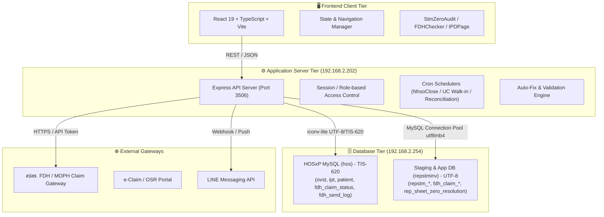
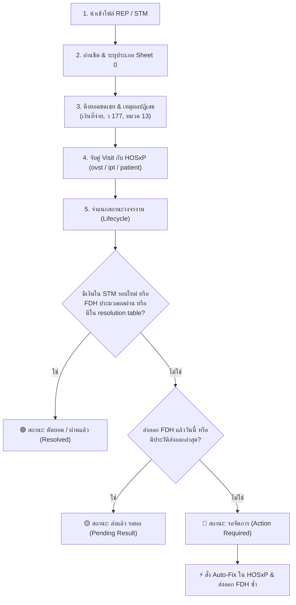

# สถาปัตยกรรมระบบ ฐานข้อมูล และพิมพ์เขียวการพัฒนา FDH Checker
*(FDH Checker Architecture, Data Models & Strategic Development Blueprint)*

เอกสารฉบับนี้รวบรวมโครงสร้างเชิงเทคนิค, Data Schema, ตรรกะการประมวลผล (Business Logic), จุดเชื่อมต่อระบบ (Integration Points) และแผนงานพัฒนาต่อเนื่อง (Development Backlog & Roadmap) เพื่อใช้เป็นฐานข้อมูลในการตัดสินใจวางระบบและการพัฒนาระบบในอนาคต

---

## 1. ภาพรวมสถาปัตยกรรมระบบ (System Architecture Overview)



### สภาพแวดล้อมระบบ (Deployment Environment)
- **Web & API Host:** `192.168.2.202` (Ubuntu / Linux, Node.js v22, PM2)
  - `fdh-backend`: Port `3506`
  - `fdh-frontend`: Production Static Assets (Vite) / Reverse Proxy
- **Database Host:** `192.168.2.254` (MySQL / MariaDB, Port 3306)
  - ฐานข้อมูลโรงพยาบาลหลัก: `hos` (HOSxP, Collation TIS-620)
  - ฐานข้อมูลระบบตรวจสอบและลูกหนี้: `repstminv` (Collation `utf8mb4_unicode_ci`)

---

## 2. โครงสร้างฐานข้อมูลหลักที่จำเป็น (Essential Data Models & Schemas)

### 2.1 ตารางกลุ่ม REP / STM Ingestion & Staging (`repstminv`)

| ชื่อตาราง | วัตถุประสงค์ | ฟิลด์สำคัญ |
| :--- | :--- | :--- |
| `repstm_import_batch` | เก็บประวัติการอัปโหลดไฟล์ REP / STM / INV | `id`, `source_filename`, `sheet_name`, `data_type` ('REP'/'STM'/'INV'), `replaces_batch_id`, `created_at` |
| `repstm_import_row` | เก็บข้อมูลดิบรายแถวจาก Excel/Text (Archived Rows) | `id`, `batch_id`, `row_no`, `data_type`, `raw_data` (JSON/TEXT), `amount`, `paid_amount`, `errorcode`, `verifycode` |
| `repstm_statement_data` | เก็บแถวที่ผ่านการแปลงเป็นมาตรฐาน (Normalized Rows) | `id`, `batch_id`, `vn`, `an`, `hn`, `tran_id`, `service_datetime`, `amount`, `paid_amount`, `raw_data` |
| `rep_data` | ตารางคู่ขนานสำหรับเก็บข้อมูล REP ราย Visit | `id`, `tran_id`, `hn`, `vn`, `an`, `date_serv`, `date_ae`, `errorcode`, `verifycode` |

### 2.2 ตารางกลุ่มติดตามและบันทึกสถานะ FDH (`hos` & `repstminv`)

| ชื่อตาราง | ที่อยู่ฐานข้อมูล | วัตถุประสงค์และฟิลด์สำคัญ |
| :--- | :--- | :--- |
| `fdh_send_log` | `hos` (HOSxP) | บันทึกประวัติการส่งออกเคลม Real-time: `fdh_send_log_id`, `fdh_send_log_vnan`, `fdh_send_log_type`, `fdh_send_log_date`, `fdh_send_log_message` |
| `fdh_claim_status` | `hos` (HOSxP) | สถานะเคลมจาก สปสช. FDH: `fdh_claim_status_id`, `vn`, `transaction_uid`, `fdh_claim_status_message` ('settled', 'cut_off_batch', 'unclaimed', 'rejected', 'received') |
| `fdh_claim_detail_row` | `repstminv` | ข้อมูลรายการ 16 แฟ้มที่ส่งเข้า FDH: `id`, `batch_id`, `vn`, `an`, `hn`, `claim_status` ('ประมวลผลผ่าน', 'ส่งข้อมูลเรียบร้อย', 'โอนเงินเรียบร้อย', ฯลฯ), `upload_uid` |
| `mophclaim_send` | `repstminv` | บันทึกประวัติการส่งออกจากโปรแกรม FDH Checker: `vn`, `type`, `senddate`, `flag`, `note` |

### 2.3 ตารางระบบตัดยอดและจัดการผลการชดเชย (Resolution & Reconciliation)

```sql
-- ตารางเก็บสถานะการตัดยอด Data Sheet 0 ที่สร้างขึ้นใหม่
CREATE TABLE IF NOT EXISTS rep_sheet_zero_resolution (
  id BIGINT AUTO_INCREMENT PRIMARY KEY,
  audit_id VARCHAR(64) NOT NULL UNIQUE,     -- 'raw-1234' หรือ 'stm-5678'
  vn VARCHAR(32) NULL,
  an VARCHAR(32) NULL,
  hn VARCHAR(32) NULL,
  tran_id VARCHAR(191) NULL,
  status VARCHAR(32) NOT NULL DEFAULT 'resolved', -- 'resolved', 'auto_settled', 'dismissed'
  resolved_reason VARCHAR(255) NULL,        -- 'ส่ง FDH ผ่านแล้ว', 'ชดเชยใน STM แล้ว', 'ตัดหนี้สูญ'
  resolved_by VARCHAR(128) NULL,            -- ชื่อผู้ใช้งานหรือ 'Auto-Sync'
  resolved_at TIMESTAMP DEFAULT CURRENT_TIMESTAMP,
  note TEXT NULL,
  INDEX idx_vn (vn),
  INDEX idx_an (an),
  INDEX idx_tran_id (tran_id),
  INDEX idx_status (status)
) ENGINE=InnoDB DEFAULT CHARSET=utf8mb4 COLLATE=utf8mb4_unicode_ci;
```

---

## 3. ตรรกะการประมวลผลหลัก (Core Business Logic)



### 3.1 การประมวลผล Data Sheet 0
1. **การอ่านยอดเงินชดเชย 0 บาท (`originalPaidAmount`):**
   - ตรวจจับคอลัมน์ภาษาไทยและอังกฤษ: `เงินที่จ่าย`, `จำนวนเงินที่จ่าย`, `ชดเชยสุทธิ`, `จ่ายชดเชย`, `paid_amount`, `net_paid`
   - คัดแยกค่าว่าง (`null`) ออกจาก `0.00` บาทอย่างเด็ดขาด เพื่อป้องกันความสับสนระหว่างเคสรอคำนวณกับเคสปฏิเสธจ่าย
2. **การดึงเหตุผลที่แท้จริงจาก สปสช.:**
   - ดึงจาก `raw_data['เหตุผล']` หรือ `raw_data['คำอธิบาย']` โดยตรง (เช่น แจ้งตามหนังสือ ว 177 หมวด 8, 11, 14, 15 หรือหมวด 13 ไม่จ่ายรหัส 55020/55021)
3. **ระบบ ⚡ Auto-Fix Engine:**
   - **รหัส Authen / Claim Code:** ตรวจสอบและดึง Authen Code จากประวัติการขอสิทธิใน `nhso_service_confirm` หรือฐานสิทธิ สปสช. มาเติมลงใน `ovst`
   - **ตารางรหัสโรคและหัตถการ (`ovstdiag`):** สแกนลบรหัสหัตถการที่เป็นตัวเลขตกค้างที่ทำให้ FDH ติด Error C/D
   - **งานทันตกรรม (`dtmain`):** สร้างข้อมูลหัวตารางทันตกรรมและเชื่อมโยงรายการตรวจให้ครบถ้วน

---

## 4. แผนงานพัฒนาต่อเนื่อง (System Development Backlog & Roadmap)

เพื่อยกระดับระบบให้เป็น **Enterprise Hospital Revenue Cycle Platform** เต็มรูปแบบ แนะนำลำดับขั้นตอนการพัฒนาดังนี้:

### ระยะที่ 1: ระบบ Background Auto-Reconcile Daemon (High Priority)
- **ปัญหาปัจจุบัน:** ผู้ใช้ยังต้องกดปุ่ม `🔄 ซิงค์ตัดยอดอัตโนมัติ` ด้วยตนเองในหน้าเว็บ
- **แนวทางพัฒนา:**
  - สร้าง Scheduler (Cron Job) ทำงานเบื้องหลังทุก 1-2 ชั่วโมง
  - ตรวจสอบรายการใน `repstm_import_row` (Sheet 0) เทียบกับผลใน `fdh_claim_status` และ `repstm_statement_data` ล่าสุด
  - หากพบว่ารายการใดสถานะเปลี่ยนเป็น "ผ่าน" หรือมี STM จ่ายเงินเข้ามา ให้ Insert เข้า `rep_sheet_zero_resolution` อัตโนมัติ พร้อมส่งสรุปเข้า LINE ให้ทีมการเงินทราบ

### ระยะที่ 2: ระบบ AI Pre-Submission Validator & Auditor (High Priority)
- **ปัญหาปัจจุบัน:** แก้ไขเคสหลังจากที่ สปสช. ปฏิเสธ (Post-Claim Audit) ทำให้เสียเวลารอบละ 15-30 วัน
- **แนวทางพัฒนา:**
  - นำกฎการตรวจจับที่ได้จาก Data Sheet 0 (เช่น รหัสหัตถการซ้ำ, สิทธิ Walk-in ผิดกลุ่ม, สิทธิขาด Authen, กฎการเบิกยาแผนไทย) ไปใส่ในขั้นตอน **Pre-Submission Validation** (หน้าก่อนส่งออก FDH)
  - ป้องกันไม่ให้รายการที่มีโอกาสติดยอด 0 หลุดออกไปยัง สปสช. ตั้งแต่แรก

### ระยะที่ 3: ระบบสร้างเอกสารทักท้วง e-Claim/OSR อัตโนมัติ (Medium Priority)
- **ปัญหาปัจจุบัน:** เคสติดรหัส D (เช่น D011, D012, D013) บางส่วนไม่สามารถส่งซ้ำผ่าน FDH ได้ ต้องทักท้วงผ่าน OSR หรือทำหนังสือชี้แจง
- **แนวทางพัฒนา:**
  - เพิ่มปุ่ม "📄 สร้างแบบฟอร์มขอทักท้วง OSR" ในหน้า Data Sheet 0
  - รวบรวมข้อมูล HN, VN, AN, วันที่บริการ, ยอดเรียกเก็บ, ข้อผิดพลาดเดิม และข้อมูลเวชระเบียนที่บันทึกเพิ่ม ออกมาเป็นไฟล์ Excel/PDF ตามฟอร์แมตที่ สปสช. กำหนด

### ระยะที่ 4: Dashboard ผู้บริหารและสถิติการกู้คืนรายได้ (Executive Revenue Recovery)
- **ปัญหาปัจจุบัน:** ผู้บริหารยังไม่เห็นมูลค่าเงินรวมที่ถูกตัดจ่าย 0 บาท และมูลค่าเงินที่ทีมงานสามารถ "กู้คืน (Recover)" กลับมาได้
- **แนวทางพัฒนา:**
  - เพิ่มหน้า Dashboard สรุป KPI:
    - ยอดเงินสูญเสียใน Data Sheet 0 ทั้งหมดตามช่วงเวลา
    - ยอดเงินที่แก้ไขและส่งผ่านสำเร็จแล้ว (Recovered Value)
    - สาเหตุการถูกปฏิเสธยอดเงิน 5 อันดับแรก (Top 5 Denial Reasons) เพื่อใช้ปรับปรุงระบบเวชระเบียนของแพทย์และพยาบาล

### ระยะที่ 5: การปรับปรุงประสิทธิภาพฐานข้อมูล (Performance & Index Optimization)
- **แนวทางพัฒนา:**
  - เพิ่ม Index บน `repstm_import_row`: `CREATE INDEX idx_dt_paid ON repstm_import_row(data_type, paid_amount);`
  - ทำ Partitioning บนตาราง `repstm_import_row` ตามปีงบประมาณ เพื่อรองรับข้อมูลเคลมระดับล้านแถวโดยไม่หน่วง

---

## 5. สรุปรายการไฟล์และซอร์สโค้ดสำคัญของระบบ

| ไฟล์ | หน้าที่และความรับผิดชอบ |
| :--- | :--- |
| `src/components/StmZeroAuditPanel.tsx` | หน้าจอ UI ตรวจสอบ Data Sheet 0, Lifecycle Tabs, ปุ่ม Auto-Fix, และปุ่มตัดยอด |
| `src/utils/stmZeroAudit.ts` | ตรรกะการอ่านข้อมูลแถวดิบ, การอ่านยอดเงิน, การคำนวณสถานะ Lifecycle, และการตรวจจับสถานะผ่าน |
| `server/repositories/stmZero.repository.ts` | Backend Data Access Layer: Query แถวจาก HOSxP/REP, ตรวจสอบสถานะ FDH, จัดการตาราง `rep_sheet_zero_resolution` |
| `server/repSheetZeroAutoFix.ts` | กลไกตรวจและแก้ไขข้อมูล HOSxP อัตโนมัติ (Claim Code, Authen Code, ovstdiag, dtmain) |
| `server/index.ts` | API Endpoints: `/batch-fix`, `/resolve`, `/unresolve`, `/auto-sync-resolve`, `/stm-zero` |
| `server/db/connection.ts` | ตัวจัดการ Connection Pool แยก 2 ฐานข้อมูล (`hos` UTF-8 wrapper และ `repstminv` utf8mb4) |
