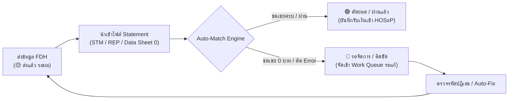

# แผนยุทธศาสตร์และพิมพ์เขียวการพัฒนา 7 ระบบหลัก FDH Checker

เอกสารนี้รวบรวมแผนสถาปัตยกรรม กรอบการพัฒนา และขั้นตอนปฏิบัติการสำหรับ 7 ระบบหลักที่ได้รับคัดเลือกเป็นเป้าหมายสำคัญของโรงพยาบาล

---

## 1. Pre-flight Error Guard ในหน้าจอส่งออก (Zero-Error Export)

### วัตถุประสงค์
ป้องกันไม่ให้มีไฟล์ที่ส่งออกไปยังเว็บ FDH หรือ MOPH API เกิดข้อผิดพลาดหรือถูกปฏิเสธ (Reject) ทั้ง Batch ด้วยการตรวจจับความผิดพลาด 100% ก่อนกดส่งออกหรือดาวน์โหลด

### องค์ประกอบการตรวจจับ (Guard Rules)
1. **OPD Encounter Structure Guard:**
   - ตรวจจับเคส OPD ที่มีค่า `AN` ติดค้างอยู่ในตาราง `ovst` และตัดค่า `AN` ให้ว่างอัตโนมัติในทุกแฟ้ม (`INS`, `CHT`, `CHA`, `AER`, `ADP`, `DRU`)
2. **Insurance & Authen Guard (แฟ้ม INS):**
   - สิทธิ UCS (บัตรทอง): ตรวจสอบว่าต้องมีเลข Authen (`PERMITNO`) ห้ามว่าง
   - สิทธิ OFC (ข้าราชการ): ตรวจสอบรหัสขออนุมัติเบิกจ่ายยานอก/สิทธิพิเศษ (`_approveCode`)
   - สิทธิ LGO (อปท.): ตรวจสอบความถูกต้องของสิทธิย่อย
3. **Drug Standard Catalog Guard (แฟ้ม DRU):**
   - ตรวจจับรหัสยาที่มี `DRUGPRIC <= 0` หรือขาดรหัสมาตรฐาน 24 หลัก (`DIDSTD` / TMT)
   - แจ้งเตือนยาที่ยังไม่ได้จับคู่ Drug Catalog ทันที
4. **Procedure & ADP Code Guard (แฟ้ม ADP / OOP):**
   - ตรวจจับรหัสที่ขึ้นต้นด้วย `UNMAPPED:` หรือรายการค่าบริการที่ยังไม่ได้กำหนดรหัส ADP ตามมาตรฐาน สปสช.
   - ตรวจสอบกฎการห้ามนวด/ประคบสมุนไพรซ้ำในวันเดียวกัน (ตามหนังสือ ว 447)
5. **Interactive UI Action:**
   - บนหน้าจอ `FDHCheckerPage.tsx` มีกล่องสรุป **Pre-flight Status Bar**:
     - `🟢 ผ่านเกณฑ์สมบูรณ์ (พร้อมส่งออก)`
     - `🟡 มีคำเตือนแต่ส่งได้ (Warnings)`
     - `🔴 ติดขัด ต้องแก้ไขก่อนส่ง (Errors)` พร้อมปุ่ม **"⚡ แก้ไขอัตโนมัติทันที (Auto-Fix)"**

---

## 2. กองทุนเฉพาะทาง (Special Funds Pre-audit)

### วัตถุประสงค์
ยกระดับการตรวจสอบความสมบูรณ์ของเวชระเบียนและค่าบริการเฉพาะกลุ่ม เพื่อให้ได้รับเงินชดเชยค่าบริการเต็มเม็ดเต็มหน่วย

### กองทุนเป้าหมายที่เพิ่มการตรวจสอบเชิงลึก
1. **กองทุนฟอกไต (Hemodialysis - HD):**
   - ตรวจสอบการบันทึกรหัสการฟอกเลือดด้วยเครื่องไตเทียม (รหัส 58301, 58302)
   - ตรวจสอบรอบการฟอกไตประจำสัปดาห์/เดือน เทียบกับสิทธิการเบิก
   - ตรวจสอบรายการยากลุ่มยากระตุ้นการสร้างเม็ดเลือดแดง (EPO) และยานอกบัญชีที่เกี่ยวข้อง
2. **กองทุนยาสมุนไพรและแพทย์แผนไทย (Herb & Thai Traditional Medicine):**
   - ยาสมุนไพรกลุ่ม Fee Schedule (`HERB_FS`) และกลุ่ม Global Budget (`HERB_GB`)
   - ตรวจสอบการผูกรหัส TMT และรหัสการวินิจฉัยกลุ่มแพทย์แผนไทย (`U-codes` เช่น U50-U77) ให้ตรงตามเงื่อนไข
3. **กองทุนกายภาพบำบัดและการฟื้นฟูสมรรถภาพ (Physical Therapy & Rehab):**
   - ตรวจสอบรหัสหัตถการกายภาพบำบัดและการบันทึกคะแนนประเมินสมรรถภาพ (Barthel ADL index)
4. **กองทุนส่งเสริมสุขภาพและป้องกันโรค (PPFS & NCDs Screenings):**
   - คัดกรองเบาหวาน/ความดัน (DM/HT)
   - คัดกรองมะเร็งปากมดลูก (HPV DNA / Pap Smear)
   - ฝากครรภ์คุณภาพ (ANC 5 ครั้ง) และวัคซีนเด็กแรกเกิด

---

## 3. วงจรปิดการกระทบยอด REP/STM กับ HOSxP (Full-cycle Reconciliation)

### วัตถุประสงค์
เชื่อมโยงผลการจ่ายเงินจริงจาก สปสช./กรมบัญชีกลาง/ประกันสังคม เข้าสู่ระบบ เพื่อปิดวงจรการเรียกเก็บเงินและตัดยอดลูกหนี้อัตโนมัติ



### กลไกการทำงาน
1. **Auto-Match Engine:**
   - จับคู่ด้วย `TRAN_ID` -> `VN` -> `HN + วันที่รับบริการ` -> `CID`
2. **การปรับปรุงสถานะ 4 ระดับ (Lifecycle Sync):**
   - `⚪ ทั้งหมด`: ดูภาพรวม
   - `🔴 รอจัดการ`: รายการชดเชย 0 บาท หรือติดรหัสปฏิเสธ (Data Sheet 0)
   - `🟡 ส่งแล้ว รอผล`: รายการที่ส่งออก FDH แล้ว แต่อยู่ระหว่างรอไฟล์ STM งวดถัดไป
   - `🟢 ตัดยอด / ผ่านแล้ว`: พบยอดเงินชดเชยจริง ปลดหนี้และตัดยอดออกจากบัญชีลูกหนี้
3. **การส่งต่อเข้า HOSxP:**
   - มีระบบส่งประวัติการรับชดเชยกลับเข้าตารางบัญชีลูกหนี้ของ HOSxP โดยตรง

---

## 4. การติดตามยอดค้างรับ Global Budget / Point System

### วัตถุประสงค์
บริหารจัดการกระแสเงินสดและรับรู้รายได้พึงรับสำหรับกลุ่มค่าบริการที่จ่ายชดเชยปลายปีงบประมาณตามระบบจัดสรรคะแนน (Point System)

### ปัญหาที่พบในปัจจุบัน
- ข้อมูล Data Sheet 0 จำนวนมาก (เช่น กลุ่ม `HERB_GB`) ได้รับการแจ้งว่า:
  *"รอประมวลผลจ่ายเงินชดเชยสิ้นปีงบประมาณตามระบบ Point system within Global budget"*
- หน่วยบริการมักไม่ทราบว่ามียอดเงินที่ถูกกักไว้จำนวนเท่าใด และคาดว่าจะได้รับเงินจริงกี่บาท

### ฟังก์ชันที่พัฒนา
1. **Global Budget Tracker Dashboard:**
   - สรุปจำนวนเคส คะแนน (Points) และยอดเงินเรียกเก็บรวม (Claimed Amount)
   - จำแนกตามกองทุนย่อย: ยาสมุนไพร GB, กายภาพบำบัด GB, บริการเฉพาะเขต
2. **Point Rate Estimator (แบบจำลองอัตราจ่ายต่อพอยต์):**
   - กำหนดอัตราประมาณการต่อพอยต์ (เช่น 0.80 – 1.00 บาท/พอยต์ หรือตามสถิติปีก่อนหน้า)
   - คำนวณยอดเงินพึงรับประมาณการ (Estimated Accrued Revenue)
3. **Year-end Settlement Comparison:**
   - เมื่อถึงรอบสิ้นปีงบประมาณและมี STM รอบปิดบัญชีเข้ามา สามารถนำมาเปรียบเทียบยอดจริงกับยอดประมาณการได้ทันที

---

## 5. ระบบจัดการลูกหนี้สิทธิการรักษา (Receivable Aging & Settlement)

### วัตถุประสงค์
ติดตามและควบคุมยอดลูกหนี้ค้างชำระจากทุกกองทุน (UC, ข้าราชการ, ประกันสังคม, บุคคลที่มีปัญหาสถานะและสิทธิ) เพื่อป้องกันหนี้สูญ

### รายละเอียดระบบ
1. **Receivable Aging Analysis (รายงานอายุหนี้):**
   - แบ่งช่วงอายุหนี้อัตโนมัติตามวันรับบริการ/วันที่ส่งเบิก:
     - 0 – 30 วัน (ปกติ / อยู่ในรอบเบิก)
     - 31 – 60 วัน (รอ Statement งวดปกติ)
     - 61 – 90 วัน (เริ่มล่าช้า ต้องตรวจสอบ)
     - 91 – 180 วัน (วิกฤต ต้องเร่งรัดหรืออุทธรณ์)
     - เกิน 180 วัน (หนี้ค้างนาน / พิจารณาจำหน่ายหนี้สูญ)
2. **Settlement & Write-off Workflow:**
   - บันทึกการกระทบยอดเงินโอนเข้าบัญชีโรงพยาบาล
   - บันทึกส่วนต่างค่ารักษาพยาบาล (ผลต่างจากการติด C หรือปรับลดอัตรา)
   - ระบบเสนอขอจำหน่ายหนี้สูญตามระเบียบพัสดุ/การเงิน พร้อมหลักฐาน REP ปฏิเสธ
3. **Financial Accounting Export:**
   - ส่งออกข้อมูลเป็นรายงานทางบัญชีมาตรฐาน (Excel/PDF) เพื่อส่งให้กลุ่มงานการเงินและพัสดุบันทึกบัญชีแยกประเภท

---

## 6. ปรับสถาปัตยกรรม Backend แยกตาม Domain (Modularization)

### วัตถุประสงค์
เพิ่มเสถียรภาพ ความเร็ว และความง่ายในการดูแลรักษา ด้วยการแตกไฟล์ขนาดใหญ่ (`server/index.ts` 6,600+ บรรทัด) ออกเป็นโมดูลย่อยที่มีขอบเขตความรับผิดชอบชัดเจน

### โครงสร้างโมดูลเป้าหมาย (Clean Architecture)

```
server/
├── modules/
│   ├── fdh/                   # บริการ FDH: Export 16 แฟ้ม, Submit API, Status Tracking
│   │   ├── fdh.controller.ts
│   │   ├── fdh.service.ts
│   │   └── fdh.routes.ts
│   ├── reconciliation/        # บริการกระทบยอด: STM/REP, Data Sheet 0, Lifecycle
│   │   ├── recon.controller.ts
│   │   ├── recon.service.ts
│   │   └── recon.routes.ts
│   ├── receivables/           # บริการลูกหนี้: Aging, Settlement, Global Budget
│   │   ├── receivable.controller.ts
│   │   └── receivable.routes.ts
│   ├── nhso/                  # บริการ สปสช.: Authen Code, ปิดสิทธิ, e-Claim
│   │   ├── nhso.service.ts
│   │   └── nhso.routes.ts
│   └── audit/                 # บริการตรวจสอบ: Pre-flight, Fund Rules, Clinical Rules
│       ├── audit.service.ts
│       └── audit.routes.ts
├── middlewares/               # Request safety, Auth, Roles, Error handlers
└── server.ts                  # Bootstrap entry point (ขนาดสั้น < 200 บรรทัด)
```

---

## 7. ระบบแจ้งเตือนเชิงรุกผ่าน LINE Notify / LINE OA

### วัตถุประสงค์
ส่งข้อมูลสำคัญถึงหัวหน้างานและเจ้าหน้าที่ผู้รับผิดชอบโดยอัตโนมัติ เพื่อให้แก้ไขปัญหาได้ทันท่วงทีโดยไม่ต้องรอเปิดหน้าจอคอมพิวเตอร์

### รูปแบบข้อความและการแจ้งเตือน (Notifications)
1. **Daily Work & Claim Overview (สรุปผลการเคลมประจำวัน - เวลา 08:30 น.):**
   - จำนวนผู้รับบริการ OPD/IPD เมื่อวาน
   - ยอดส่ง FDH สำเร็จ / ยอดรอส่ง
   - ยอดเคสที่ติด Error หรือยังไม่มีเลข Authen
2. **FDH & STM Real-time Alert:**
   - แจ้งเตือนทันทีเมื่อมีไฟล์ STM / REP งวดใหม่นำเข้าสู่ระบบ
   - สรุปยอดเงินโอนเข้า และจำนวนเคสที่ผ่าน / ถูกตัดเงิน
3. **Urgent Reject Alert (เคสติดขัดเร่งด่วน):**
   - แจ้งเตือนเคสที่ถูกปฏิเสธ (Reject) ที่ใกล้ครบกำหนดเวลาอุทธรณ์ (เช่น ภายใน 15 วัน)
4. **Interactive LINE Bot (สอบถามข้อมูลผ่าน LINE):**
   - เจ้าหน้าที่สามารถพิมพ์ค้นหา HN หรือ VN เพื่อดูสถานะการเคลมผ่าน LINE ได้ทันที
